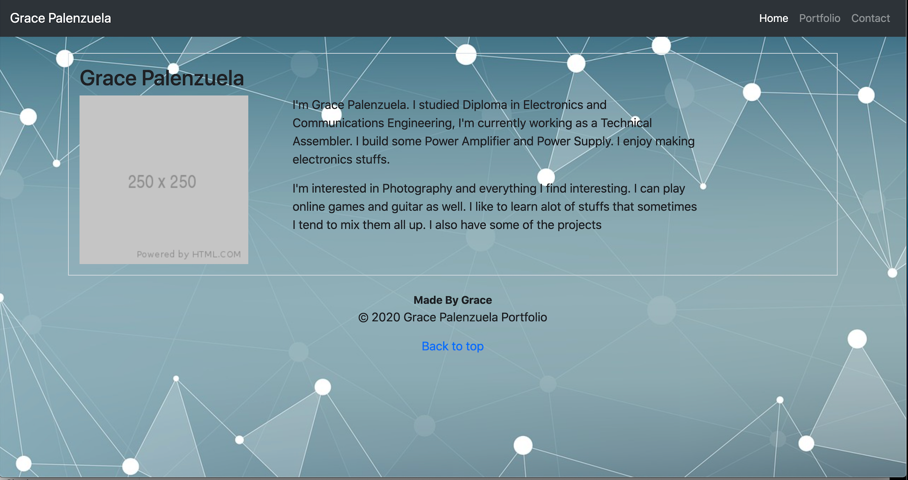

# Responsive-Portfolio

## Description

This Portfolio shows the use of Bootstrap CSS Framework and show how responsive a webpage can be using it.

In this file, 3 sets of html have been made to make a contact page, portfolio page and a homepage. Each of this have a responsive NavBar. And a layout in which we can see when we tried the inspect part of the browser.

I have used a grid system and a bit of JS in the html file. I have put in the portfolio some of the images I took.

